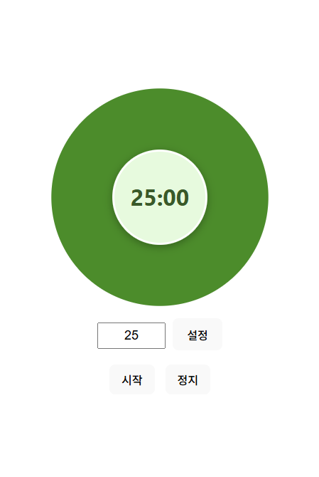
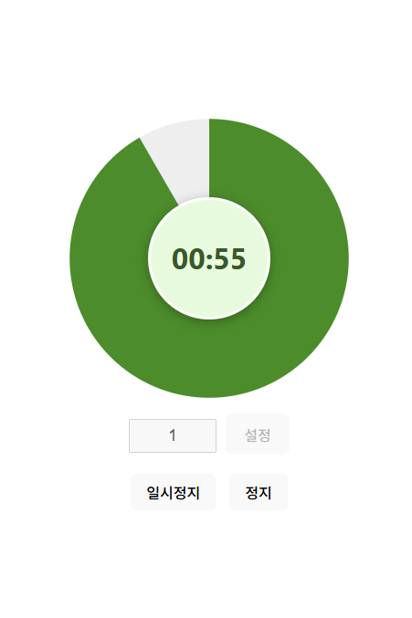
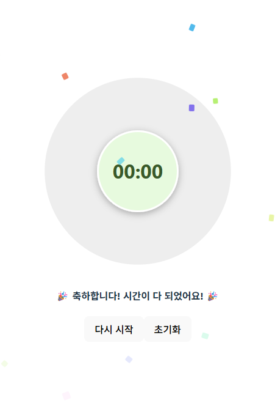

## GREEN TOMATO TIMER

Green Tomato Timer is your cheerful little companion for staying focused!  
Inspired by the Pomodoro Technique, it helps you work in short, effective bursts with playful green-tomato vibes.  
Whether you're studying, coding, or tackling your to-do list, this timer keeps you on track — one tomato at a time. 🍅

(And honestly... I just got tired of the classic red pomodoro.😂)

 

## 그린 토마토 타이머

초록마토 타이머는 당신의 집중을 도와주는 귀여운 동반자예요!  
뽀모도로 기법에서 영감을 받아, 짧고 효율적인 작업 시간을 귀여운 초록 토마토 분위기와 함께 제공합니다.  
공부든, 코딩이든, 할 일을 처리하는 순간이든, 이 타이머는 한 번에 한 토마토씩 당신을 목표까지 안내합니다. 🍅

(그리고 사실... 이제 빨간색 뽀모도로가 질릴 때도 됐잖아요....?😂)

 

  
  
  

